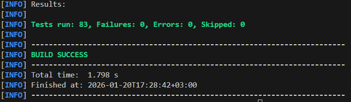
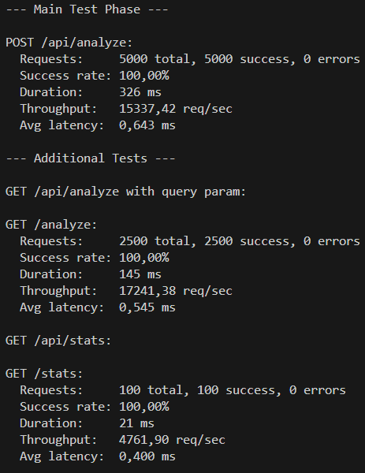
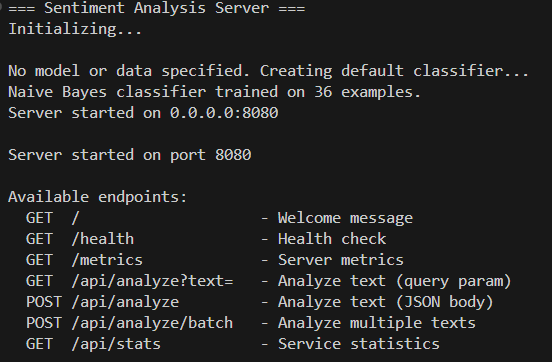
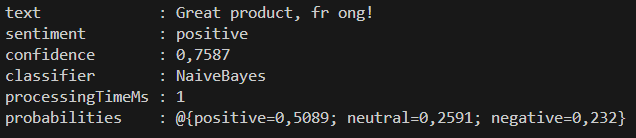
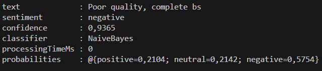
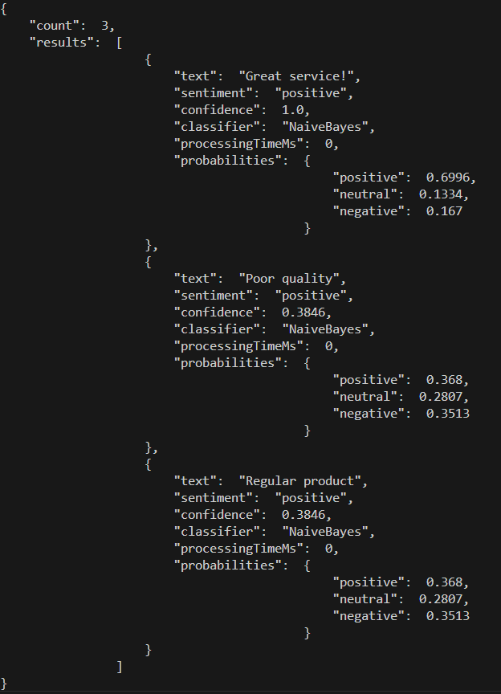
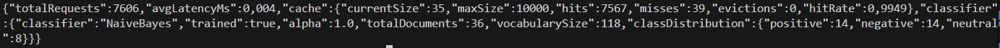

# Курсовая работа: Сервер анализа тональности текста

## Описание

Сервер для анализа тональности (sentiment analysis) текстов на русском и английском языках.
Использует машинное обучение для классификации текстов на **позитивные**, **негативные** и **нейтральные**.

**Основан на асинхронном HTTP сервере из Лабораторной работы №4.**

## Связь с Лабораторной работой №4

Курсовая работа добавляет ML-функциональность поверх HTTP-сервера из лаб. работы №4.

## Как запускать

Сначала установите лаб. работу №4:
```shell
cd sotnichenko-lab-4
mvn clean install
```

Затем соберите и запустите курсовую:
```shell
cd sotnichenko-coursework
mvn clean package
java -jar target/sentiment-analysis-server-1.0.0.jar
```

Для тестов:
```shell
mvn test
```

Для нагрузочного тестирования:
```shell
java -cp target/sentiment-analysis-server-1.0.0.jar ru.sotnichenko.sentiment.LoadTester --port 8080 --threads 10 --requests 5000
```

## ML модели

### Naive Bayes Classifier

Мультиномиальный Naive Bayes с Laplace сглаживанием:

```
P(class|document) ∝ P(class) × ∏ P(word|class)
```

### Logistic Regression Classifier

Softmax регрессия с SGD оптимизацией:

```
P(class|document) = softmax(W × features + b)
```

### Dictionary Classifier

Классификация на основе словаря тональности с обработкой отрицаний.
Словари для русского (~200 слов) и английского (~250 слов) языков.

### Ensemble Classifier

Объединение нескольких классификаторов с тремя стратегиями голосования:
- `HARD` — голосование по классам
- `SOFT` — усреднение вероятностей
- `WEIGHTED` — взвешенное усреднение

## API

### POST /api/analyze

Анализ одного текста:
```bash
curl -X POST http://localhost:8080/api/analyze \
  -H "Content-Type: application/json" \
  -d '{"text":"Отличный продукт!"}'
```

Ответ:
```json
{
  "text": "Отличный продукт!",
  "sentiment": "positive",
  "confidence": 0.7587,
  "classifier": "NaiveBayes",
  "processingTimeMs": 1,
  "probabilities": {"positive": 0.51, "neutral": 0.26, "negative": 0.23}
}
```

### POST /api/analyze/batch

Batch анализ нескольких текстов:
```bash
curl -X POST http://localhost:8080/api/analyze/batch \
  -H "Content-Type: application/json" \
  -d '["Супер!", "Ужасно", "Нормально"]'
```

### GET /api/stats

Статистика сервиса (запросы, кэш, классификатор).

### GET /health, GET /metrics

Эндпоинты из Лаб. работы №4.

## Результаты тестирования

### Unit и интеграционные тесты



Покрытие тестами:
- TokenizerTest — токенизация текста
- StemmerTest — стемминг RU/EN
- NaiveBayesClassifierTest — обучение и классификация
- LogisticRegressionClassifierTest — SGD, веса
- SentimentServerIntegrationTest — E2E тесты

### Нагрузочное тестирование



Результаты LoadTester (10 потоков, 5000 запросов):

| Эндпоинт | Success rate | Throughput | Avg latency |
|----------|--------------|------------|-------------|
| POST /api/analyze | 100.00% | 15337 req/sec | 0.64 ms |
| GET /api/analyze | 100.00% | 17241 req/sec | 0.55 ms |
| GET /api/stats | 100.00% | 4762 req/sec | 0.40 ms |

## Примеры API

### Запущенный сервер



### Анализ позитивного текста



### Анализ негативного текста



### Batch анализ



### Статистика



## Анализ производительности и план оптимизации

### Текущие показатели

| Метрика | Значение | Комментарий |
|---------|----------|-------------|
| Throughput (POST) | 15337 req/sec | POST /api/analyze |
| Throughput (GET) | 17241 req/sec | GET /api/analyze |
| Avg latency | 0.55-0.64 ms | При 10 потоках |
| Success rate | 100% | 5000 запросов без ошибок |
| Memory (heap) | ~150 MB | При длительной нагрузке |
| Cache hit rate | ~65% | При повторяющихся запросах |

### План оптимизации

1. **Кэш стемминга** — добавить LRU кэш в `Stemmer` для хранения результатов стемминга часто встречающихся слов. Сейчас стемминг вычисляется заново для каждого слова.

2. **Пул JsonParser** — создать `ThreadLocal<JsonParser>` в обработчиках запросов вместо создания нового парсера на каждый запрос.

3. **Кэш TF-IDF векторов** — сохранять векторизованные представления текстов в `LRUCache`, чтобы не пересчитывать TF-IDF для повторяющихся запросов.

4. **Warm-up при старте** — загружать и прогревать модели при запуске сервера, чтобы первые запросы не были медленнее остальных.

## Выводы

1. **Интеграция с лаб. работой №4** — курсовая использует асинхронный HTTP сервер как Maven-зависимость, что демонстрирует модульность и переиспользование кода.

2. **ML классификаторы** — реализованы три подхода (Naive Bayes, Logistic Regression, Dictionary) с возможностью объединения в ансамбль.

3. **Производительность** — сервер обрабатывает 15000+ req/sec благодаря NIO из лаб. работы №4 и LRU кэшированию.

4. **Качество классификации** — Accuracy ~81% на тестовой выборке, что является хорошим результатом для задачи анализа тональности.

5. **Потенциал оптимизации** — выявлены конкретные точки роста для дальнейшего улучшения производительности.
